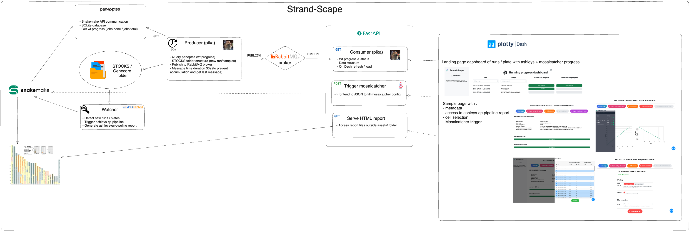

# Strand-Scape v0.1.0 Documentation

Welcome to Strand-Scape v0.1.0, an intuitive web platform designed to enhance the user experience for MosaiCatcher via a graphical interface.

## Introduction

Strand-Scape simplifies the process of utilizing MosaiCatcher by providing a streamlined interface. 

## Running Strand-Scape (admin side)

#TODO 

- Conda env (dash, rabbitmq, fastapi, pika, ...)
- 1. rabbitmq-server
- 2. publisher.py
- 3. fastapi_consumer.py
- 4. app.py

## Using Strand-Scape (user side)

#TODO
## Structure of Strand-Scape

Strand-Scape's architecture consists of two primary sections: Frontend and Backend.

### Frontend

The frontend has two main sub-sections:

1. **Landing Page**: 
    - Displays the workflow progression of Strand-Seq runs and associated samples.
    - Provides insights into generated runs, available samples, and the execution status of the Ashleys-QC pipeline and MosaiCatcher.

2. **Sample Page**: 
    - Accessible by clicking on a specific sample name.
    - Comprises five distinct sections, navigable via individual buttons:
        - **Homepage**: Shows sample metadata and the progression of workflows.
        - **Ashleys-QC Report**: Renders an HTML report from the Ashleys-QC pipeline, presenting various figures and auto-generated results.
        - **Cell Selection**: Features a side "offcanvas" menu to view Ashleys-QC predictions and manage the inclusion or exclusion of libraries for the MosaiCatcher SV calling process. Ensure to **Save** your selections.
        - **Run MosaiCatcher (initially locked)**: Becomes available after saving cell selections. Enables users to configure MosaiCatcher with minimal customization. It displays the count of cells included in the analysis and requires an email input to keep a record of the user conducting each sample analysis.
        - **MosaiCatcher Report (initially locked)**: Becomes accessible post the completion of the MosaiCatcher workflow. Users can view SV-related figures and statistics in a secondary HTML report.
    - The frontend is crafted using Plotly Dash, complemented by the Dash Mantine & Bootstrap frameworks.

### Backend

The backend infrastructure includes:

- **FastAPI Web Server**: An asynchronous server integrated with a pika consumer that connects to the RabbitMQ broker. If the panoptes/pika publisher is offline, the server reverts to loading the most recent status from a backup JSON file. 
  
- **RabbitMQ Broker**: Handles message queues for the system.

- **Pika Publisher**: Periodically queries panoptes (every 30 seconds) to balance system load and publishes updates to the RabbitMQ broker.

- **Panoptes**: Real-time monitoring of snakemake workflows.

## Roadmap and Future Enhancements

- Introducing functional refresh buttons (currently implemented but hidden).
- Define and integrate mapping from snakemake parameters to dash components (text input, number, switch, dropdown) 

---

**⚠️ Warning**

**Please note** that as of now, Strand-Scape is not set up as a standalone user platform. This means:

- All group members have shared access to data that's been generated and processed.
- Once a sample is processed by a user, it cannot be reprocessed by another user. Enhancements in future versions will address this limitation.

---
